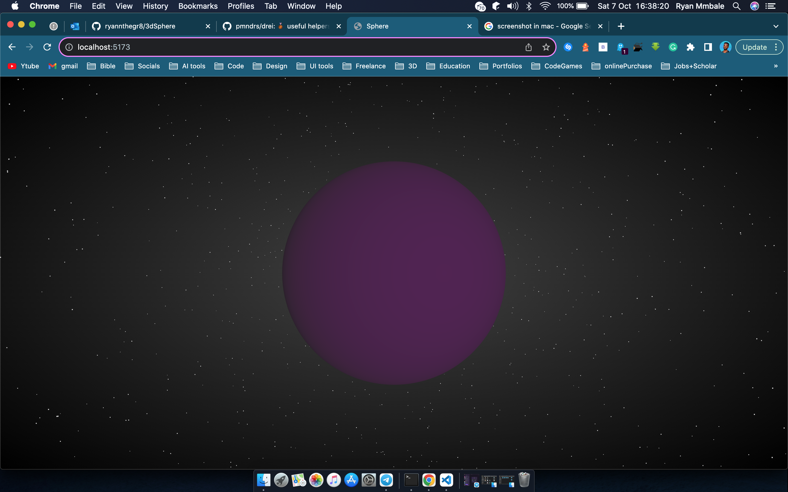

# 3D Sphere

Has concepts of a spinning sphere in a 3D environment

## How to start the project

Once you have already cloned the project write the command below;

            npm install && npm run dev

The screenshot below shows how the sphere looks like:

